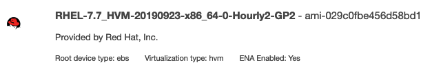

# Running Red Hat Enterprise Linux 7.7 as EKS Worker Nodes

## Setup
* Red Hat Enterprise Linux 7.7

 
* Kubernetes 1.16.8 on AWS EKS

## Workflow
* Provision an EC2 Server with RHEL 7.7
** Example AMI: RHEL-7.7_HVM-20190923-x86_64-0-Hourly2-GP2 - ami-029c0fbe456d58bd1
* Install the following dependencies.
```
sudo yum install -y git vim 
```
* Clone this repo and Execute install-worker.sh
```
git clone https://github.com/codaglobal/aws-eks-rhel-workers.git
cd aws-eks-rhel-workers
sh install-worker.sh
```
* Create an AMI of this server.
* Update the included cluster.yml file with these parameter changes:
  * "metadata" section:
    *  "name" - name of the target EKS cluster
    * "region" - region of the target EKS cluster
  * "nodeGroups" section:
    * "name" - desired name of the new nodegroup
    * "NodeImageId" - Image ID of the AMI created in the previous step.
    * "desiredCapacity" - desired number of nodes in the group
    * "minSize" - minimum number of nodes in the group
    * "maxSize" - input the minimum and maximum node group size
    * "privateNetworking" - use private subnets for the nodes?
    * "ssh" / "publicKeyPath" - local path to a public SSH key that will be used to create the nodes
* Provision a CloudFormation stack for the cluster using the updated cluster.yml file:
`
eksctl create nodegroup -f ./eksctl/cluster.yml
` 

